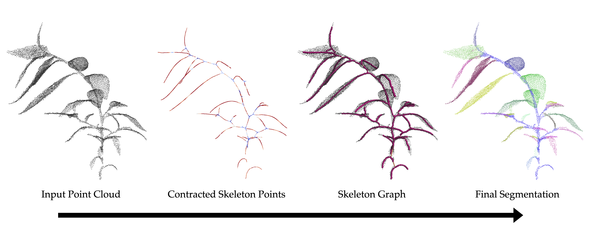
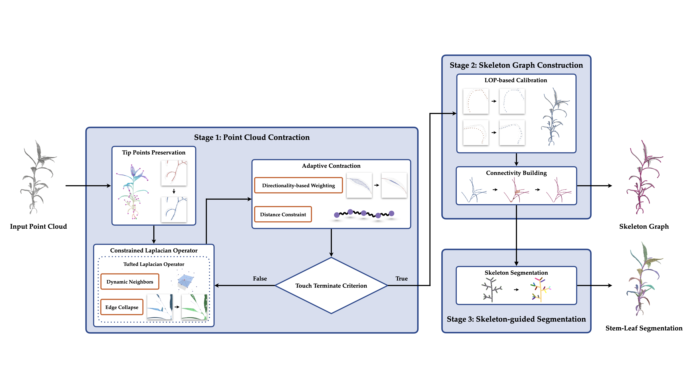
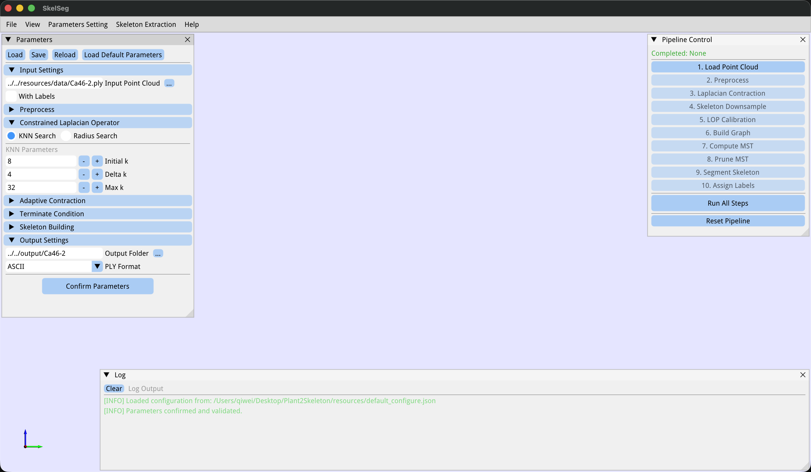
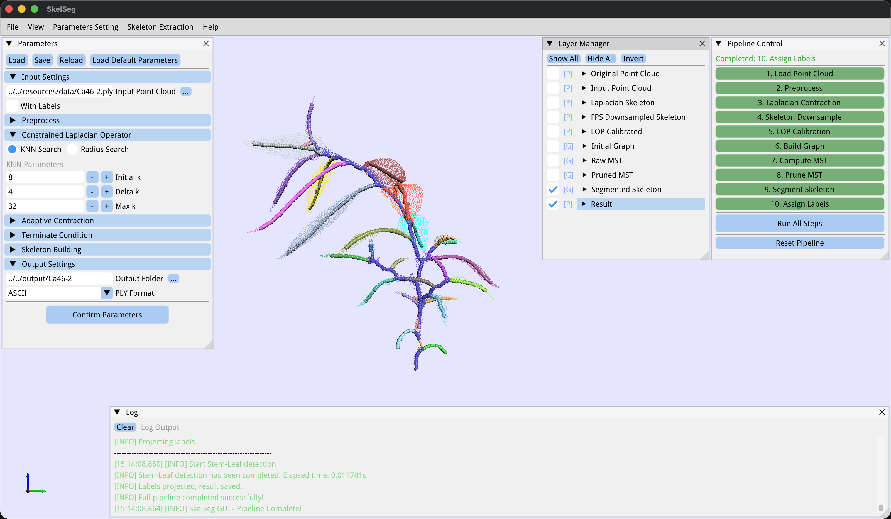

<div align="center">

# SkelSeg

### Plant Skeleton Extraction and Stem-Leaf Segmentation from 3D Point Clouds

[](./LICENSE)
[](https://github.com/qiweishen/Plant2Skeleton/actions/workflows/ubuntu-build.yml)
[](https://github.com/qiweishen/Plant2Skeleton/actions/workflows/macos-build.yml)
[](https://github.com/qiweishen/Plant2Skeleton/actions/workflows/windows-build.yml)

---

## Abstract

We present **SkelSeg**, a two-stage framework for curve-skeleton extraction and stem–leaf segmentation from single-plant point clouds. SkelSeg enhances Laplacian-Based Contraction (LBC) by introducing a *constrained Laplacian operator* and *adaptive contraction* that stabilize contraction on irregular clouds and suppress non-manifold artifacts, yielding centrally aligned and topologically consistent skeletons. From the LOP-calibrated skeleton points we build a minimum spanning tree and hierarchically decompose it to separate the stem from individual leaves; skeleton-guided projection then transfers the labels to the original cloud, producing both stem–leaf semantic segmentation and per-leaf instance segmentation. The system is implemented in C++20 and ships with an interactive Easy3D/ImGui viewer plus C++ and Python evaluators for quantitative benchmarking.

---

## Pipeline

1. **Constrained Laplacian Contraction** — iteratively contracts the cloud onto its medial structure.
2. **LOP Calibration** — Farthest-Point Sampling reduces the contracted cloud, then a modified LOP operator re-anchors each surviving point to the local medial axis.
3. **Topology Recovery** — a graph is built over the calibrated skeleton points; Kruskal's MST gives a tree; short branches below `Noise_Branch_Length_Ratio × diag(AABB)` are pruned.
4. **Stem–Leaf Decomposition** — the lowest tip is taken as the root; tips are traced back to their first branching vertex to define leaves; the longest shared path is the stem. Labels are propagated to the original cloud by nearest-skeleton-vertex projection.

---

## Repository Structure

```
SkelSeg/                  # Core code
application/viewer/       # Easy3D + ImGui interactive viewer
evaluation/skeleton/      # C++ skeleton-quality evaluator (Chamfer, forward/reverse)
evaluation/segmentation/  # Python semantic + instance metrics (sklearn / scipy)
deps/                     # Vendored: Eigen, geometry-central, Easy3D, KDTree, ...
resources/                # default_configure.json + sample plant data
Docker/                   # Dockerfile + docker-compose.yml
```

The build produces three executables under `Release/bin/`:

| Target | Role |
|---|---|
| `SkelSeg` | Command-line skeleton + segmentation pipeline |
| `SkelSeg_Viewer` | Interactive viewer with per-stage inspection |
| `SkeletonEvaluator` | Forward / reverse / Chamfer distance between cloud and skeleton |

---

## Installation

**Requirements.** C++20 (GCC ≥ 11, Clang ≥ 14), CMake 3.22–3.25, OpenMP, Boost (`graph`). The viewer additionally needs OpenGL, GLFW, GLEW, and X11 dev libs on Linux. All other libraries (Easy3D, Eigen, fmt, geometry-central, KDTree, nlohmann/json, plywoot) are vendored under `deps/`.

```bash
# Ubuntu / Debian
sudo apt update
sudo apt install -y build-essential cmake ninja-build 
sudo apt install -y libomp-dev libboost-all-dev \
					libgl1-mesa-dev libglu1-mesa-dev \
					libglfw3-dev libglew-dev \
					libxrandr-dev libxinerama-dev \
					libxcursor-dev libxi-dev libx11-dev

# macOS
brew install cmake ninja libomp boost glfw glew
```

```bash
git clone https://github.com/qiweishen/Plant2Skeleton.git
cd SkelSeg
mkdir Release && cd Release
cmake -DCMAKE_BUILD_TYPE=Release ..
make -j$(nproc)
```

A `Docker/docker-compose.yml` is also provided for an Ubuntu 22.04 dev container.

---

## Quick Start

A sample plant model ships at `resources/data/Ca46-2.ply`.

```bash
# 1. point the config at the sample input + an output folder
$EDITOR resources/default_configure.json
#    "Point_Cloud_File_Path": "../../resources/data/Ca46-2.ply"
#    "Output_Folder_Path":    "../../output"

# 2. run the CLI (results land in output/Ca46-2/)
./Release/bin/SkelSeg

# 3. or explore stage-by-stage in the GUI
./Release/bin/SkelSeg_Viewer
```

Each input `Plant.ply` produces a folder containing the per-stage PLYs (`1_Input.ply`, `2_FPS-Downsampled.ply`, `3_LOP-Calibrated.ply`, `4_Initial-Graph.ply`, `5_MST-Raw.ply`, `6_MST-Pruned.ply`, `7_MST-Segmented.ply`) and the final `Plant_Result.ply` whose vertices carry two extra properties: `pred-semantic` (`0` = stem, `1` = leaf) and `pred-instance` (`-1` = stem, `0, 1, 2, …` = leaf ID).

And `.iteration` folder stores the contracted skeleton point at every iterations.

---

## Interactive Viewer

`SkelSeg_Viewer` runs the same pipeline interactively. Stages can be triggered individually or as *Run All*, parameters edited live, and any layer toggled in the *Layer Manager*.

---

# Configuration

All runtime parameters live in a single JSON file (`resources/default_configure.json` by default). Geometric thresholds are expressed as ratios of the normalized AABB diagonal so that the same configuration generalizes across plants of different physical scale.

<details>
<summary><b>Full parameter reference</b></summary>

| Section | Parameter | Default |
| --- | --- | --- |
| **Input** | `Batch_Processing` | `false` *(CLI mode only)* |
| | `Batch_Processing_Folder_Path` | — *(batch mode only)* |
| | `Point_Cloud_File_Extension` | — *(batch mode only)* |
| | `Point_Cloud_File_Path` | — *(single-file mode only)* |
| | `With_Labels` | `false` |
| | `Labels_Names.PLY_Format` | — |
| | `Labels_Names.TXT_XYZ_Format` | — |
| **Preprocess** | `Down_Sample_Number` | `10240` |
| | `Normalize_AABB_Length` | `1.6` |
| | `Normalize_Center` | `auto` *(computed at runtime; do not set manually)* |
| | `Normalize_Scaling` | `auto` *(computed at runtime; do not set manually)* |
| **Constrained Laplacian Operator** | `Use_KNN_Search` | `true` |
| | `Use_Radius_Search` | `false` |
| | `Initial_k` | `8` |
| | `Delta_k` | `4` |
| | `Max_k` | `32` |
| | `Initial_Radius_Search_Ratio` | `0.015` |
| | `Delta_Radius_Search_Ratio` | `0.005` |
| | `Min_Radius_Search_Ratio` | `0.005` |
| **Adaptive Contraction** | `Smooth_Sigma_Threshold` | `0.9` |
| | `Sigma_Sphere_Radius_Ratio` | `0.015` |
| | `Max_Distance_Ratio` | `0.005` |
| **Termination** | `Max_Iteration` | `25` |
| | `Convergence_Threshold` | `1e-4` |
| **Skeleton Building** | `Down_Sample_Ratio` | `0.1` |
| | `LOP_Sphere_Radius_Ratio` | `0.045` |
| | `Noise_Branch_Length_Ratio` | `0.001` |
| **Output** | `Output_Folder_Path` | — |
| | `Output_PLY_File_DataFormat` | `"ASCII"` \| `"Binary"` |

</details>

---

## Evaluation

**Skeleton quality (C++).**

```bash
./build/bin/SkeletonEvaluator <point_cloud.ply> <skeleton.ply>
```
Reports the forward (cloud $\rightarrow$ skeleton, mean and 90th percentile), reverse (skeleton $\rightarrow$ cloud, mean), and Chamfer distance between an input cloud and a skeleton graph.

**Segmentation quality (Python).**
```bash
pip install numpy scipy scikit-learn plyfile
cd eval/segmentation && python3 main.py
```
Computes per-class Precision / Recall / F1 / IoU and overall accuracy for stem–leaf semantic segmentation, and MUCov, MWCov, AP@0.5, per-class Precision / Recall for leaf instance segmentation. Edit the source / destination paths at the bottom of `main.py` to match your output layout.

---

## Citation

```bibtex
@article{skelseg,
  title   = {SkelSeg: Plant Skeleton Extraction and Stem-Leaf Segmentation from 3D Point Clouds},
  author  = {XXX, YYY, ZZZ},
  journal = {XXXX},
  year    = {2026}
}
```

---

## Acknowledgments

SkelSeg builds on [Easy3D](https://github.com/LiangliangNan/Easy3D), [Eigen](https://eigen.tuxfamily.org/), [{fmt}](https://github.com/fmtlib/fmt), [geometry-central](https://github.com/nmwsharp/geometry-central), [KDTree](https://github.com/crvs/KDTree), [nlohmann/json](https://github.com/nlohmann/json), [Boost.Graph](https://www.boost.org/doc/libs/release/libs/graph/), and [plywoot](https://github.com/ton/plywoot).

---

## License

Released under the **GNU General Public License v3.0**. See [`LICENSE`](./LICENSE).
