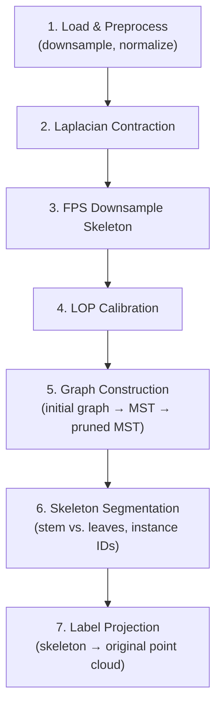

# Plant2Skeleton

**Automatic plant point cloud skeletonization and segmentation.**

Plant2Skeleton extracts curve-skeleton structures from 3D plant point clouds using Laplacian-based contraction, constructs a topological graph, and segments the point cloud into **stem** (shoot) and individual **leaf** instances. It provides both a command-line interface for batch processing and an interactive GUI viewer for step-by-step visualization of the pipeline.

## 1. Key Features

- **Skeleton Extraction** -- Iterative Laplacian contraction with adaptive weights and distance constraints, followed by LOP (Locally Optimal Projection) refinement.
- **Graph Construction** -- Minimum Spanning Tree (MST) computation with noise-branch pruning to produce a clean topological skeleton.
- **Semantic Segmentation** -- Binary classification of every point as *stem* or *leaf*.
- **Instance Segmentation** -- Assignment of unique instance IDs to individual leaves.
- **Interactive Viewer** -- Easy3D/ImGui-based GUI with 10-stage pipeline visualization, parameter tuning, and layer management.

---

## 2. Pipeline Overview



| Stage | Description | Output File |
|-------|-------------|-------------|
| 1 | Load point cloud, uniform downsample to target count, normalize to unit sphere | `1_Input.ply` |
| 2 | Iterative contraction via constrained Laplacian operator with adaptive WL/WH weights | `.iterations/cpts_*.ply` |
| 3 | Farthest Point Sampling to reduce skeleton points | `2_FPS-Downsampled.ply` |
| 4 | LOP operator refines skeleton positions toward the medial axis | `3_LOP-Calibrated.ply` |
| 5 | Build radius-based graph, compute MST (Kruskal), prune short branches | `4_Initial-Graph.ply`<br />`5_MST-Raw.ply`<br />`6_MST-Pruned.ply` |
| 6 | Traverse pruned MST to identify root, shoot path, and leaf branches; assign semantic + instance labels | `7_MST-Segmented.ply` |
| 7 | Nearest-neighbor projection of skeleton labels to every point in the original cloud | `*_Result.ply` |

---

## 3. Project Structure

```
Plant2Skeleton/
├── SkelSeg/                    # Core library and CLI
│   ├── include/                # Public headers
│   │   ├── skeleton.h          # Laplacian contraction
│   │   ├── lop.h               # LOP calibration
│   │   ├── graph.h             # Graph building & segmentation
│   │   ├── tools.h             # I/O, preprocessing, utilities
│   │   └── utility/
│   │       ├── logger.h        # Thread-safe singleton logger
│   │       ├── timer.h         # High-resolution timer
│   │       ├── evaluator.h     # Skeleton quality metrics
│   │       └── config_validator.h  # JSON config validation
│   └── src/                    # Implementation
│       ├── main.cpp            # CLI entry point
│       ├── skeleton.cpp
│       ├── lop.cpp
│       ├── graph.cpp
│       └── tools.cpp
├── app/
│   └── viewer/                 # Interactive GUI viewer
│       ├── main.cpp            # Viewer application (ImGui panels)
│       ├── viewer.h            # ViewerImGui base class
│       ├── viewer.cpp
│       └── CMakeLists.txt
├── deps/                       # Third-party dependencies (vendored)
│   ├── eigen/                  # Eigen 3.4.0
│   ├── geometry-central/       # Geometry-central (modified)
│   ├── Easy3D/                 # Easy3D (rendering, I/O)
│   ├── KDTree/                 # KDTree 2.0.1
│   ├── nlohmann/               # nlohmann/json 3.11.3
│   ├── plywoot/                # PLY I/O
│   └── fmt/                    # {fmt} formatting
├── eval/                       # Python evaluation scripts
│   ├── evaluate.py
│   ├── semantic.py
│   └── instance.py
├── Docker/
│   └── Dockerfile              # Ubuntu 22.04 dev environment
├── configure.json              # Runtime configuration
└── CMakeLists.txt              # Top-level build script
```

---

## 4. Interactive Viewer

The GUI viewer (`app/viewer/`) provides an interactive environment for running and inspecting each pipeline stage.

### 4.1 Visualization Stages

| # | Stage | Visualization |
|---|-------|---------------|
| 1 | Load Point Cloud | Raw input point cloud |
| 2 | FPS Downsample | Downsampled input |
| 3 | Laplacian Contraction | Contracted point cloud |
| 4 | FPS Downsample | Skeleton points after FPS |
| 5 | LOP Calibration | Calibrated skeleton points |
| 6 | Build Graph | Initial skeleton graph (edges) |
| 7 | Compute MST | Minimum Spanning Tree |
| 8 | Prune MST | Pruned MST |
| 9 | Segment Skeleton | Color-coded skeleton (stem/leaf instances) |
| 10 | Assign Labels | Final segmented point cloud with instance colors |

### 4.2 GUI Panels

- **Parameter Panel** -- Edit all configuration parameters in real time; load/save JSON config files.
- **Pipeline Control** -- Run individual stages or the full pipeline; stages execute in a background thread.
- **Log Panel** -- Thread-safe, scrollable log output capturing `std::cout` and Logger messages.
- **Layer Manager** -- Toggle visibility of each visualization layer (point clouds, graphs, meshes).

---

## 5. Dependencies

All third-party libraries are vendored under `deps/` and built automatically by CMake. The following system-level packages are required:

| Dependency | Version | Purpose |
|------------|---------|---------|
| C++ Compiler | C++20 support (GCC 11+, Clang 14+) | `std::ranges`, `std::filesystem` |
| CMake | 3.22 -- 3.25 | Build system |
| OpenMP | -- | Parallel processing |
| Boost | graph component | Graph algorithms (MST, adjacency list) |
| OpenGL / GLFW / GLEW | -- | Viewer rendering (only for `SkelSeg_Viewer`) |
| X11 libs | -- | Windowing on Linux (only for `SkelSeg_Viewer`) |

Bundled libraries (no manual installation needed):

| Library | Version | Purpose |
|---------|---------|---------|
| Eigen | 3.4.0 | Linear algebra, sparse solvers |
| geometry-central | modified | Geodesic distance, local triangulation, heat method |
| Easy3D | 2.6.1 | 3D rendering, point cloud I/O, ImGui integration |
| nlohmann/json | 3.11.3 | JSON configuration parsing |
| plywoot | 0.1.0 | Fast PLY file I/O |
| KDTree | 2.0.1 | K-d tree nearest-neighbor search |
| {fmt} | 12.1.0 | String formatting |

---

## 6. Build Instructions

### 6.1 Prerequisites

Install system-level dependencies (Ubuntu/Debian):

```bash
sudo apt-get install -y \
    build-essential cmake ninja-build pkg-config \
    libomp-dev libboost-all-dev \
    libgl1-mesa-dev libglu1-mesa-dev libglfw3-dev libglew-dev \
    libxrandr-dev libxinerama-dev libxcursor-dev libxi-dev libxext-dev libx11-dev
```

### 6.2 Build from Source

```bash
mkdir build && cd build
cmake .. -G Ninja -DCMAKE_BUILD_TYPE=Release
ninja
```

This produces two executables:

| Target | Description |
|--------|-------------|
| `SkelSeg` | Command-line skeleton extraction tool |
| `SkelSeg_Viewer` | Interactive GUI viewer |

### 6.3 Docker (docker-compose)

A `docker-compose.yml` is provided under `Docker/` with an Ubuntu 22.04 development environment. It pre-configures volume mounts for the workspace, X11/Wayland display forwarding, audio, and debugging capabilities (ptrace, seccomp).

Build the image and start an interactive shell:

```bash
cd Docker
docker compose up -d --build
docker compose exec skelseg-dev bash
```

Inside the container, the project is mounted at `/workspace`. Build as usual:

```bash
cd /workspace
mkdir build && cd build
cmake .. -G Ninja -DCMAKE_BUILD_TYPE=Release
ninja
```

Stop and remove the container when done:

```bash
docker compose down
```

---

## 7. Configuration

All runtime parameters are specified in `configure.json`. The file is read at startup and a copy is saved alongside the output.

### A. Input Settings

| Field | Type | Description |
|-------|------|-------------|
| `Batch_Processing` | bool | `true` for batch mode (process all files in a folder) |
| `Batch_Folder_Path` | string | Folder containing input point clouds (batch mode) |
| `Point_Cloud_File_Path` | string | Path to a single input file (single mode) |
| `Point_Cloud_File_Extension` | string | File extension filter for batch mode (e.g. `.ply`) |
| `With_Labels` | bool | Whether the input file contains ground-truth labels |
| `Labels_Names` | object | Label column names/indices for PLY and TXT/XYZ formats |

### B. Preprocessing

| Field | Type | Default | Description |
|-------|------|---------|-------------|
| `Down_Sample_Number` | int | 10240 | Target point count after uniform downsampling |
| `Normalize_Diagonal_Length` | float | 1.6 | Diagonal length of the normalized bounding box |

### C. Constrained Laplacian Operator

| Field | Type | Default | Description |
|-------|------|---------|-------------|
| `Use_KNN_Search` | bool | true | Use KNN for neighborhood construction |
| `Use_Radius_Search` | bool | false | Use radius search for neighborhood construction |
| `Initial_k` | int | 8 | Initial KNN neighbor count |
| `Delta_k` | int | 4 | KNN increment per iteration |
| `Max_k` | int | 32 | Maximum KNN neighbor count |
| `Initial_Radius_Search_Ratio` | float | 0.015 | Initial search radius (fraction of diagonal) |
| `Delta_Radius_Search_Ratio` | float | 0.005 | Radius increment per iteration |
| `Min_Radius_Search_Ratio` | float | 0.005 | Minimum search radius |

### D. Adaptive Contraction

| Field | Type | Default | Description |
|-------|------|---------|-------------|
| `Smooth_Sigma_Threshold` | float | 0.9 | Sigma threshold for adaptive contraction |
| `Sigma_Sphere_Radius_Ratio` | float | 0.015 | Local sphere radius for sigma computation |
| `Max_Distance_Ratio` | float | 0.005 | Maximum displacement per iteration (fraction of diagonal) |

### E. Termination Condition

| Field | Type | Default | Description |
|-------|------|---------|-------------|
| `Max_Iteration` | int | 25 | Maximum number of contraction iterations |
| `Convergence_Threshold` | float | 0.0001 | Volume ratio threshold for convergence |

### F. Skeleton Building

| Field | Type | Default | Description |
|-------|------|---------|-------------|
| `Down_Sample_Ratio` | float | 0.1 | Fraction of skeleton points to keep after FPS |
| `LOP_Sphere_Radius_Ratio` | float | 0.045 | LOP neighborhood radius (fraction of diagonal) |
| `Noise_Branch_Length_Ratio` | float | 0.001 | Minimum branch length to keep (fraction of diagonal) |

### G. Output Settings

| Field | Type | Default | Description |
|-------|------|---------|-------------|
| `Output_Folder_Path` | string | -- | Directory for all output files |
| `Output_PLY_File_DataFormat` | string | "ASCII" | PLY format: `"ASCII"` or `"Binary"` |

---

## 8. Usage

### 8.1 Command-Line Interface

1. Edit `configure.json` to set input/output paths and parameters.

2. Run the executable from the build directory:

```bash
./SkelSeg
```

The program reads `../configure.json` relative to the working directory. In **single mode**, it processes the file specified by `Point_Cloud_File_Path`. In **batch mode**, it iterates over all matching files in `Batch_Folder_Path`.

### 8.2 Supported Input Formats

| Format | Extension | Notes |
|--------|-----------|-------|
| PLY | `.ply` | ASCII or binary; vertex properties `x y z` |
| XYZ | `.xyz` | Space-separated `x y z` per line |
| TXT | `.txt` | Space-separated `x y z` per line |

When `With_Labels` is `true`, the program expects ground-truth semantic and instance labels either as additional PLY properties or as extra columns in TXT/XYZ files (configured via `Labels_Names`).

### 8.3 Interactive Viewer

```bash
./SkelSeg_Viewer
```

1. **Load configuration**: *Parameters Setting* > *Load from File* -- select a `configure.json`.
2. **Adjust parameters**: open the *Parameter Panel* to tune values.
3. **Run pipeline**: *Skeleton Extraction* > *Run All*, or open *Pipeline Control* to execute stages individually.
4. **Inspect results**: use the *Layer Manager* to toggle visibility of point clouds and graph layers at each stage.

### 8.4 Output Files

All output files are written to `Output_Folder_Path`:

```
Output/
 |-**/
    ├── 1_Laplacian-Skeleton.ply    # Contracted skeleton
    ├── 2_FPS-Downsampled.ply       # Skeleton after FPS
    ├── 3_LOP-Calibrated.ply        # Skeleton after LOP refinement
    ├── 4_Initial-Graph.ply         # Initial skeleton graph
    ├── 5_MST-Raw.ply               # Raw MST
    ├── 6_MST-Pruned.ply            # Pruned MST
    ├── 7_MST-Segmented.ply         # Segmented MST with labels
    ├── <name>_Result.ply           # Final point cloud with pred-semantic and pred-instance
    ├── configure.json              # Copy of the configuration used
    └── .log                        # Processing log
```

The final `_Result.ply` file contains two additional vertex properties:

- `pred-semantic`: `0` = stem, `1` = leaf
- `pred-instance`: `-1` = stem, `0, 1, 2, ...` = individual leaf IDs

---

## 9. Evaluation

Python scripts in `eval/` compute segmentation metrics by comparing predicted labels against ground-truth annotations.

### 9.1 Running Evaluation

```bash
cd eval
python main.py
```

**Python dependencies**: `numpy`, `scipy`, `scikit-learn`, `plyfile`

Install them with:

```bash
pip install numpy scipy scikit-learn plyfile
```

---

## License

*To be determined.*
